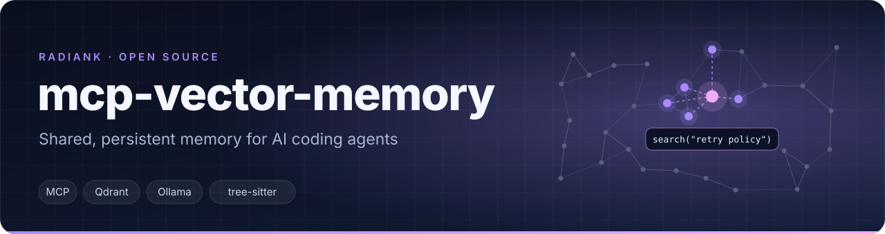
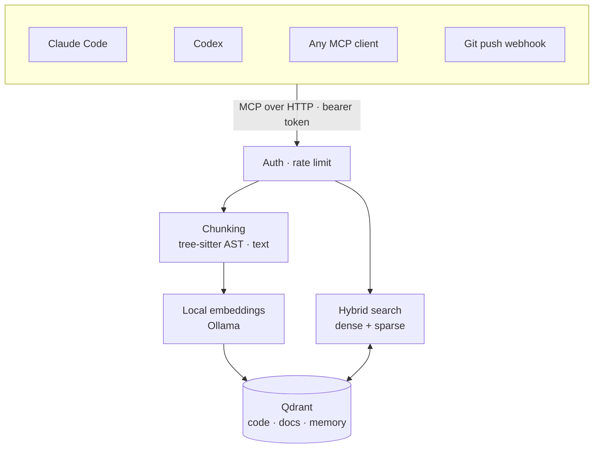

<p align="center">
  
</p>

<p align="center">
  <a href="LICENSE"></a>
  
  
  
  
</p>

---

AI coding agents forget everything between sessions, and two agents working on the same project never share what they learned. **mcp-vector-memory** is a self-hosted [Model Context Protocol](https://modelcontextprotocol.io) server that fixes both: it indexes your code and documentation into a vector database, and gives every agent tools to search it and to store decisions, conventions and lessons learned.

Claude Code, Codex or any MCP client connects to the same server and works on the same knowledge base. Embeddings are computed locally with Ollama: no code leaves your infrastructure.

## How it works



## Features

- **Code-aware indexing**: tree-sitter splits source files along functions and classes, so a result is a whole unit, not half a function
- **Hybrid search**: dense embeddings plus a sparse keyword encoder, with separate relevance thresholds for code, docs and memories
- **Agent memory**: agents store what they learn; duplicates are detected, updates use optimistic locking, deletions are soft with 30-day retention
- **Local embeddings**: `qwen3-embedding` through Ollama by default, with distinct instructions for code and text
- **Multi-project, multi-token**: each bearer token only sees the projects it is scoped to
- **Auto re-indexing**: one webhook per repository, triggered on push
- **Hardened**: per-token rate limiting, request size limits, security headers

## MCP tools

| Tool | What it does |
| --- | --- |
| `search` | Semantic and keyword search across code, docs and memories |
| `index_file` | Index or re-index a file |
| `remember` | Store a memory (decision, convention, lesson learned), with duplicate detection |
| `update_memory` | Update a memory, with optimistic locking |
| `forget` | Soft-delete a memory (30-day retention) |
| `stats` | Health and metrics of the vector store |

## Quick start

```bash
git clone https://github.com/BBerthod/mcp-vector-memory.git
cd mcp-vector-memory
cp .env.example .env                       # set QDRANT_API_KEY (openssl rand -hex 32)
# declare your projects and a random token in config/projects.yml

docker network create dokploy-network      # the compose file expects this external network
docker compose -f docker-compose.yml -f docker-compose.local.yml up -d
```

The first start pulls the embedding model (about 5 GB). The server then listens on `http://localhost:3100`.

Connect a client, for example Claude Code:

```bash
claude mcp add --transport http vector-memory http://localhost:3100/mcp \
  --header "Authorization: Bearer <your-token>"
```

## Configuration

```yaml
# config/projects.yml
projects:
  my-app:
    repo: "github.com/your-user/my-app"
    server_repo_path: "/var/repos/my-app"
    languages: [php, javascript, vue]
    exclude: [vendor, node_modules, storage]
    webhook_secret: "${MY_APP_WEBHOOK_SECRET}"

auth:
  tokens:
    <random-token>:
      name: "me"
      projects: ["my-app"]
```

| Variable | Default | Purpose |
| --- | --- | --- |
| `EMBED_MODEL_CODE` / `EMBED_MODEL_TEXT` | `qwen3-embedding:8b` | Embedding models |
| `VECTOR_SIZE` | `4096` | Embedding dimensions |
| `RATE_LIMIT_PER_HOUR` | `1000` | Requests per token per hour |
| `RATE_LIMIT_BURST` | `50` | Burst allowance |

## Stack

TypeScript · Node.js 22 · MCP SDK · Express · Qdrant · Ollama · tree-sitter · Docker Compose

## About this repository

This server runs in production behind my own agents. The repository is a weekly snapshot of the private one it is developed in. Issues and ideas are welcome.

## License

[MIT](LICENSE). Built by [Billy Berthod](https://radiank.com).
